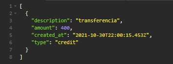

<h1 align="center">
    
</h1>

  <a href="#-instalação-e-execução">Instação e execução</a>&nbsp;&nbsp;&nbsp;|&nbsp;&nbsp;&nbsp;
    <a href="#-funcionamento">Funcionamento</a>&nbsp;&nbsp;&nbsp;|&nbsp;&nbsp;&nbsp;
  <a href="#-objetivos">Objetivos</a>

 

  

## 🛠️ Instalação e execução

1. Faça um clone desse repositório;
2. Pelo terminal, rode `yarn` para instalar as dependências;
3. Pelo terminal, rode `yarn dev` ou `node src/index.js` para inicializar a API.

## 🚀 Funcionamento

A API possui caminhos de GET, POST, PUT E DELETE para account, GET para statement e balance e POST para deposit e withdraw.

### 🧾 Rotas de conta ('/account')

`POST` - Na rota '/account', o método POST faz a inclusão da conta no sistema. É necessário passar um `cpf` e `name` no corpo da requisição. Essa rota gera um ID aleatório utilizando a biblioteca UUID (v4), que fica atrelado a conta.

`GET` - Esse método recebe apenas o parâmetro `cpf` nos headers, e retorna todos os dados da conta selecionada.

`PUT` - A rota recebe o parâmetro `name` no corpo da requisição e `cpf` nos headers. O parâmetro passado no corpo substituirá o já existente na conta selecionada.

`DELETE` - Rrecebe apenas o parâmetro `cpf` nos headers. Esse método exclui a conta selecionada.

### 📰 Rotas de extrato ('/statement')

`GET` - Esse método recebe apenas o parâmetro `cpf` nos headers, e retorna todas as transações atreladas a essa conta.

`GET` - A rota 'statement/date' recebe o parâmetro `cpf` nos headers e `date` na query da requisição. Retorna todas as transações feitas pela conta selecionada, no dia selecionado.

### 💸 Rotas de transação ('/deposit') & ('/withdraw')

`POST` (deposit) - Esse método, na rota '/deposit', recebe o parâmetro `cpf` nos headers e `description` e `amount` no corpo da requisição. Será feito um depósito na conta selecionada com o valor indicado pelo parâmetro.

`POST` (withdraw) - Esse método, na rota '/withdraw', recebe o parâmetro `cpf` nos headers e `amount` no corpo da requisição. Será feito um saque na conta selecionada com o valor indicado pelo parâmetro.

### ⚖️ Rotas de balance ('/balance')

`GET` - Esse método recebe apenas o parâmetro `cpf` nos headers, e retorna o valor total presente na conta selecionada.

## 💻 Objetivos

Essa API me ajudou a entender mais a fundo os conceitos de requisições HTML e servidores Express. Não é um projeto muito extenso, mas tentar desvendar a utilização do node me deu uma boa base do funcionamento de APIs maiores.

---

Feito com ♥ by Sofia Rodrigues Ferreira :wave: <a href="https://www.linkedin.com/in/sofiarodfer/">Contato</a>

